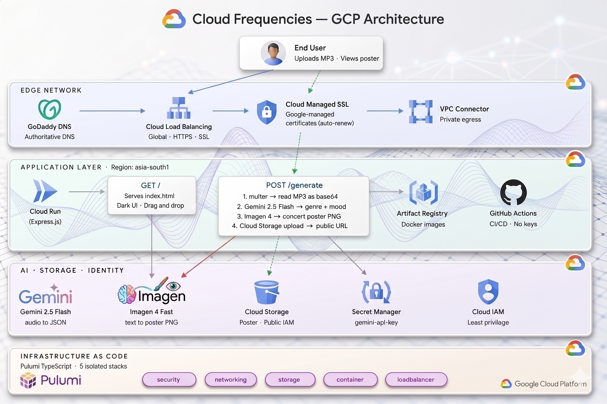

# Cloud Frequencies

Drop an MP3. Get an AI-generated concert poster.

Gemini 2.5 Flash analyses the audio, detects genre and mood, maps it to an iconic band's visual aesthetic, and Imagen 4 generates a custom concert poster in that style.

**Live:** https://cloudfrequencies.strata-app.online

---

## Architecture



```
Browser
  └── cloudfrequencies.strata-app.online (GoDaddy DNS → GCP Global Static IP)
        └── Global External Application Load Balancer
              ├── HTTP (port 80)  → redirect to HTTPS
              └── HTTPS (port 443) → Google-managed SSL cert
                    └── Backend Service → Serverless NEG
                          └── Cloud Run (asia-south1)
                                ├── Serves index.html (static frontend)
                                ├── POST /generate
                                │     ├── Gemini 2.5 Flash → genre + mood detection
                                │     ├── Imagen 4 Fast    → concert poster generation
                                │     └── GCS Bucket       → poster storage (public)
                                ├── GEMINI_API_KEY         ← Secret Manager
                                └── Service Account        ← IAM roles
```

**IaC:** Pulumi TypeScript — 5 stacks, each with isolated state

```
cloud-frequencies/
├── security/       — Service account + IAM bindings
├── networking/     — VPC, subnet, firewall, Serverless VPC connector
├── storage/        — GCS bucket + public IAM
├── container/      — Artifact Registry, Cloud Run, Secret Manager binding
└── loadbalancer/   — Global LB, SSL cert, NEG, backend, forwarding rules
```

**CI/CD:** GitHub Actions with Workload Identity Federation — no service account keys stored anywhere.

---

## The Prompt That Built This

This entire project was also built using the following single prompt in Antigravity 2.0 (Cowork by Anthropic). The manual build took 2-3 hours a day over a week. The prompt replicated the same result in hours — but only because the knowledge from the manual build was there to guide it through every error.

```
Build me a cloud-native application on GCP called Cloud Frequencies.
The concept: a user uploads an MP3, Gemini 2.5 Flash analyses the audio
to detect genre and mood, that genre is mapped to an iconic band's visual
aesthetic, and Imagen 4 generates a concert poster in that style. The poster
is stored in GCS and the public URL is returned.

Infrastructure requirements:
- Pulumi TypeScript, multi-stack architecture: security, networking, storage,
  container, loadbalancer — each as a separate stack with its own state,
  referencing each other via StackReferences
- GCP project: strata-493811, region: asia-south1
- Cloud Run (containerised Express.js app) behind a Global External Application
  Load Balancer
- Artifact Registry for Docker images
- GCS bucket with uniform bucket-level access and public IAM for poster storage
- Secret Manager for the Gemini API key, injected into Cloud Run via
  valueSource.secretKeyRef
- GitHub Actions CI/CD with Workload Identity Federation — no service account
  JSON keys
- Serverless VPC connector for private egress
- Google-managed SSL certificate for the domain cloudfrequencies.strata-app.online

Application requirements:
- Express.js server in Node.js
- POST /generate endpoint — accepts audio file upload via multer, reads as
  base64, sends to Gemini 2.5 Flash for genre/mood detection, maps genre to
  band aesthetic (Led Zeppelin for rock, Daft Punk for electronic, Miles Davis
  for jazz etc), builds Imagen 4 prompt, generates poster, uploads to GCS,
  returns JSON with genre, mood, band influence, poster URL
- Frontend served as static files from the same container — dark mythic
  illuminated manuscript UI with gold accents, Cinzel fonts, animated background
  slideshow, drag and drop audio upload, animated loading steps, poster reveal
  with shimmer

Follow strict Pulumi standards: each resource in its own .ts file, index.ts
re-exports only, Pulumi.yaml uses runtime: name: nodejs format, no package.json
inside stack folders. Every resource property on its own line, value indented
below it.
```

---

## Stack

| Layer | Technology |
|---|---|
| Infra as Code | Pulumi TypeScript |
| Cloud | GCP — Cloud Run, GCS, Secret Manager, Artifact Registry |
| Networking | Global ALB, Serverless VPC Connector, Google-managed SSL |
| AI — Audio | Gemini 2.5 Flash (`gemini-2.5-flash`) |
| AI — Image | Imagen 4 Fast (`imagen-4.0-fast-generate-001`) |
| CI/CD | GitHub Actions + Workload Identity Federation |
| Frontend | Vanilla JS, Cinzel + EB Garamond fonts |

---

## Credit

The multi-stack isolation pattern — one resource group per stack, stacks referencing each other via outputs, reducing blast radius — was ingrained through Terraform discipline taught by Ajit. When moving to Pulumi on GCP, the tool changed. The structure didn't.
